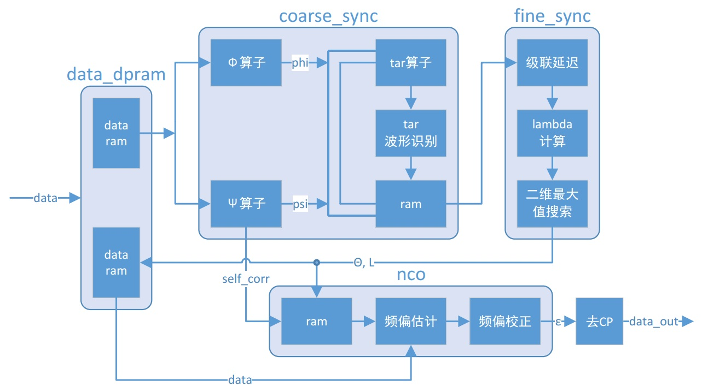

# OFDM_Synchronization
Design a new OFDM synchronization algorithm, and implement it with both Matlab and Verilog.

IDE: Matlab 2009、Vivado 2015.2

Device: ZYNQ-7000

FFT Length: 256

CP Length: 32

